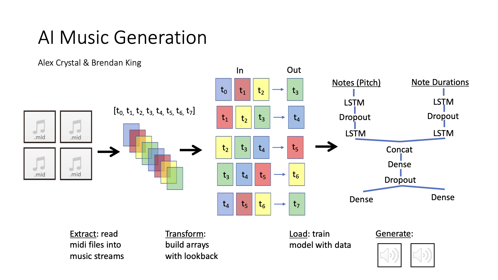

Environment
- clone the repo
- conda create -n music python=3.10
- conda activate music
- cd bach-in-business
- pip install -r requirements.txt
- flask run

Model training requires .mid files in /static/Music/ or cached files in /static/Data
Generating music requires the same and also a .h5 file in /static/Models/